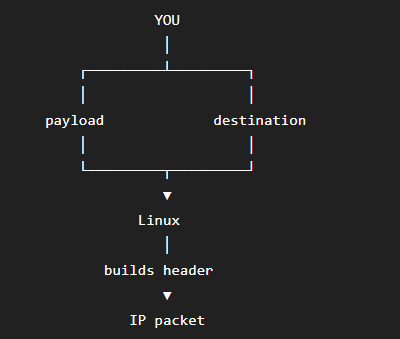
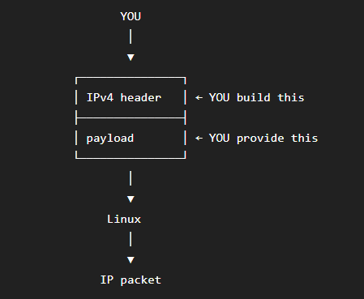

# HTTP over IP

Experiments to understand what happens when HTTP is built directly
over IP without TCP.

## Experiment 1 — Raw IP Socket

Successfully created a raw IPv4 socket using Linux's raw socket API.

- Address family: IPv4 (`AF_INET`)
- Socket type: `SOCK_RAW`
- Protocol: experimental protocol `253`
- TCP: not used
- UDP: not used
- `CAP_NET_RAW`: required

### Observation

The Linux kernel allows the process to access raw IP networking,
but privileges are required to create the socket.

### IPv4 Header Construction

#### Linux builds the header



The application provides the payload and destination address.
The Linux IPv4 layer constructs the IPv4 header.

#### Application builds the header



With `IP_HDRINCL`, the application provides the IPv4 header
along with the payload.

### First Packet

Payload:
    HELLO FROM RAW IP

The packet was sent to:
    127.0.0.1 (no port number is mentioned as we are not using TCP/UDP)

The loopback inerface was monitored using `tcpdump`

Command:

```bash
sudo tcpdump -i lo -nn 'ip proto 253' -X
```
After running the above command, and sending the packet to the destination address, this was the output observed:

```bash
tcpdump: verbose output suppressed, use -v[v]... for full protocol decode
listening on lo, link-type EN10MB (Ethernet), snapshot length 262144 bytes
06:59:34.468482 IP 127.0.0.1 > 127.0.0.1:  ip-proto-253 17
        0x0000:  4500 0025 9d70 4000 40fd 9e69 7f00 0001  E..%.p@.@..i....
        0x0010:  7f00 0001 4845 4c4c 4f20 4652 4f4d 2052  ....HELLO.FROM.R
        0x0020:  4157 2049 50                             AW.IP
```

#### Understanding the IPv4 Header

The first byte is:
    `0x45`

This contains two 4-bit fields:
    `0100 0101`
where version = `0100` and IHL = `0101`

So version = 4 means the data sent is an IPv4 packet and IHL is measured in 32-bit words, it means that one 32-bit word is 4 bytes, therefore the length of IPv4 header is `5 * 4 bytes = 20 bytes`

The next two bytes are:
    `00 25`
which is `0x0025 = 37 bytes`

Therefore:

    IPv4 header = 20 bytes
    Payload     = 17 bytes
    Total       = 37 byte`

And "HELLO FROM RAW IP" is 17 bytes